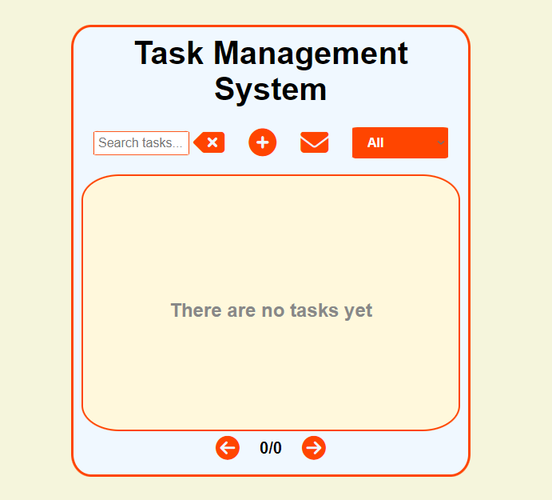
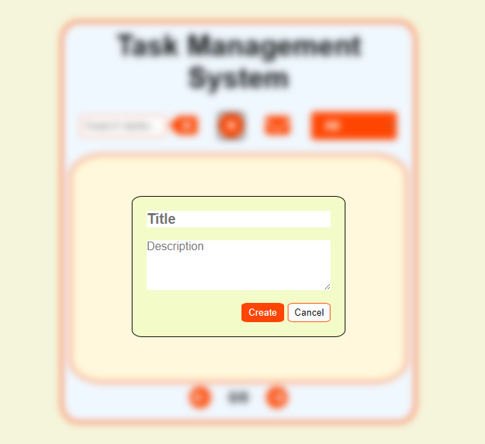
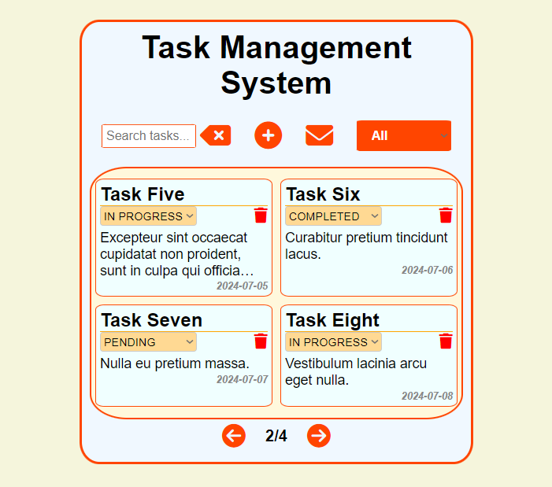
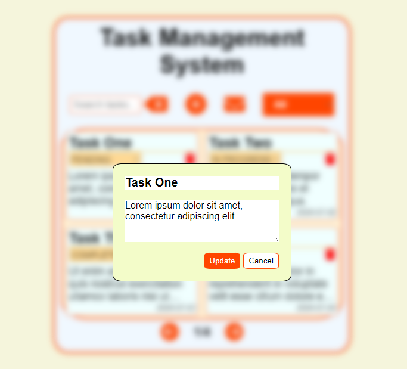
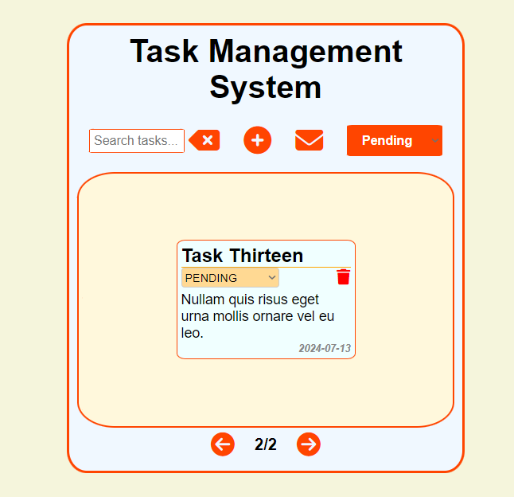
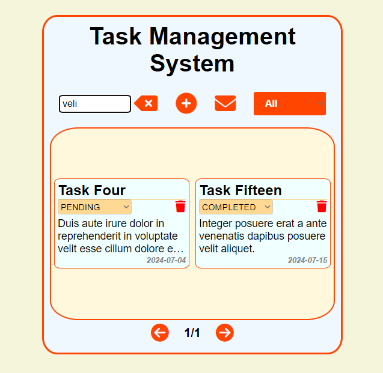
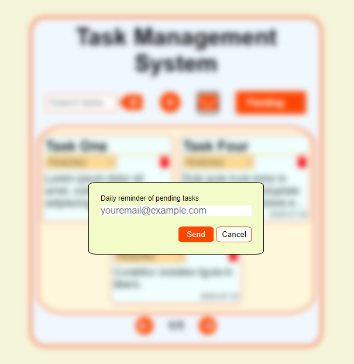

# Frontend - Task Management System

This directory contains the frontend for the task management system.

## Prerequisites

- [Backend](../backend/README.md) running on `http://localhost:8080`

## Running the Application

- **Open `index.html` in your browser** to see the frontend application in action.

## Screenshots

### 1. Empty Task List

### 2. Create Task Form

### 3. Full Task List

### 4. Update Task

### 5. Status Filter

### 6. Text Search

### 7. Reminder Feature

